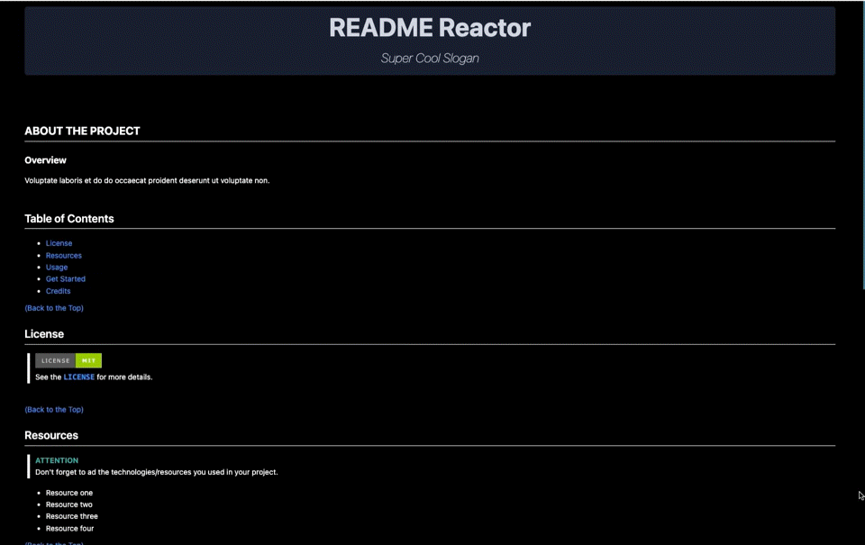

  

<h3 align="center">README Reactor</h3>

<i>Create a master README for your repo.</i>

  

 
 

## **ABOUT THE PROJECT**
### **Overview**
The README Reactor will guide you through the process of creating a professional README file that stands up to the height of your project.

By just answering a few questions, you'll give the Reactor the essential elements to run a fusion that will result in an amazing README.md for your repo, following the best practices for your project. Because remember: a great project needs a great README.
 
 
## Table of Contents
- [License](#license)
- [Resources](#resources)
- [Usage](#usage)
- [Get Started](#get-started)
- [Credits](#credits)
 

[(Back to the Top)](#about-the-project)
## License
>  
> See the **[`LICENSE`](https://github.com/Rod-Freedom/CM9-README_Reactor/blob/main/LICENSE)** for more details.

 

[(Back to the Top)](#about-the-project)
## Resources
* JS
* Node.js
* Inquirer

 

[(Back to the Top)](#about-the-project)
## Usage
The Reactor is easy and intuitive to use. To run the Reactor, you'll need to type `node index.js` in your terminal and hit `return`. Remember to be inside the README Reactor folder. After that, you'll ride in automatic; answer the questions and hit `return` after each answer.

At the end, you'll receive a message confirming that your README is now ready. The file will be generated inside a new direction (folder) called `AwesomeREADME`.

If you need help opening the terminal, read **[this guide](https://support.apple.com/guide/terminal/open-or-quit-terminal-apd5265185d-f365-44cb-8b09-71a064a42125/mac#:~:text=Terminal%20for%20me-,Open%20Terminal,%2C%20then%20double%2Dclick%20Terminal.)**.

 

Execute `node index.js` and answer. Be mindful of pressing enter only after you finish each answer!

  

 

Your new `README.md` !  If you missed something and want to generate it again, don't forget to delete the `AwesomeREADME` folder each time.

 

  

 

> **ATTENTION** 
> Remember to add the technologies/resources you used in your project.

 

[(Back to the Top)](#about-the-project)
## Get Started
Once you have the repo on your computer, open your command line. Be sure to open the README Reactor folder in your terminal. Use `npm install` to get all the modules needed to run the Reactor.

 

[(Back to the Top)](#about-the-project)
## Credits

All the code was created from scratch by [Rod's Freedom](https://github.com/Rod-Freedom).
